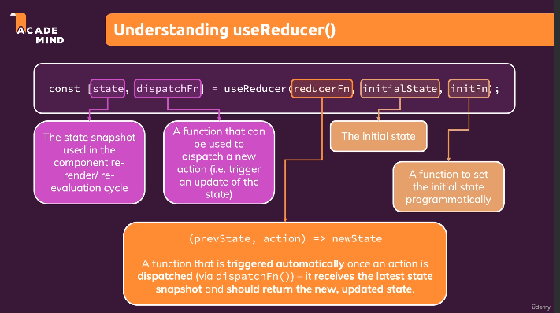
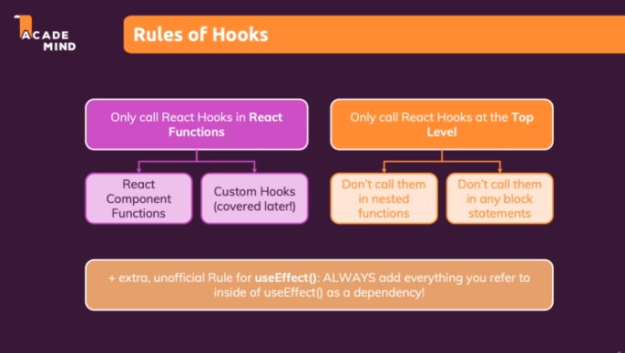

P - Practice projects

1- Intro:

1. build process
2. React JS vs Vanilla JS
3. React projects using create react app/ vite

2- JS refresher:

1. ES6

3- Basic React concepts:

1. props
2. JSX
3. try to create reusable components
   related projects: expense_tracker_project, practice_project

4- States

1. events, event handlers
2. useState hook (ALl React hooks works only inside functional components)
3. Adding forms, listening to user inputs
4. two way binding
5. working with multiple states (with object)
6. update state based on prevState
7. child to parent (bottom-up)/ lifting the state up
8. derived and computed state
9. presentational (dumb, stateless) and non-presentational (smart, stateful) components
10. controlled and uncontrolled components
    related projects: expense_tracker_project

5- Conditional Contents

1. keys
2. using state to display conditional contents
   related projects: expense_tracker_project

6- Debugging

1. check console errors
2. browser breakpoints
3. react dev tools
   related projects: course_goals_project_altered

7- Styling

1. styled components
2. css modules
   related projects: course_goals_project, investment_calculator_project (P), add_user_project (P)

8- Fragments, portals, refs

1. JSX component - should be wrapped in single element/ array(but with keys)/ fragments (preferred) (React Fragment logic - can create a component which returns props.children and use that also)
2. Portals
3. refs- helps in accessing other DOM elements & work with them.
   Mostly used in i/p elements, but can be used for any HTML element
   we can get access to real DOM node (it is suggested that we don't manipulate DOM, we can read data though)
   For read-only refs are best, if e have a case to change values state is better
4. state - controlled components (i/p in our case) as internal state is controlled by react
5. refs - uncontrolled components (i/p in our case) as internal state is not controlled by react
   we are only using a regular DOM API to make changes in DOM node but with a react feature 'refs'
   related projects: add_user_project

9 - Side effects/ effects using reducers / context API

1. 
2. useEffect - useEffect(() => {//function},[dependencies])- specified code in function runs only when dependencies change not when our component re render cycles
3. useEffect function runs after component re evaluation (render cycle) and also only if dependencies changes
4. so useEffect is helpful in data fetching which is also a side effect
5. can omit 'setFunctions' because it will stay the same in component re render cycles, but should add other var dependencies.
6. useEffect cleanup - can use this to cleanup the useEffect function before it starts running (eg) debouncing // this cleanup function only starts running from 2nd time, not on first side effect.
   cleanup runs when our componnet unmounts from DOM
7. useEffect(()=> {}) //rerenders on every time the component function re runs; useEffect(()=> {}, []) // will execute only on first time the component mounted; useEffect(()=> {},[dep]) // rerenders on the dependencies state changes; cleanup executed with empty dep array when component unmounts; cleanup executed with dep executes before useEffect function fro 2nd time
   depndencies - we can omit browser API values (setTimeout), state updating fns (setDemo)
   related projects: login_page_project
8. useReducer() - more powerful state mgmt

- complex states whicn belong together useReducer can be used
- when we update a state with the value of another state using useReducer is preferred
  (Note: if we need to update same state with prevState we can use function form ie,
  setsomeFunction((sameFunprevState)=>({ ...sameFunprevState})) )
  
- reducer function can be created outside the component fun
- In useEffect try to give specific values as dependencies, Also in nested objs try to give specific values bcoz if we give whole obj it will re render for ANY property of someObject changes - not just the one property
  related projects: login_page_project_altered

9. React context: In Bigger apps sometimes we don't need a prop in a component but may need it, but we might need to pass prop anyways for forwarding the prop which is needed in different component thus leading us to create large prop chain, here react context can be used to avoid prop chaining/ prop drilling

- context - component wide state; context can be anything (eg string) but often we use objs
- We have to provide & consume it //after creating context
- providing - wrap components in which we need these context values //any components which are not wrapped cannot listen; after giving provider all children and children of children components will have access to the context
- listening/ consuming - there are 2 ways
  If there is a default value we don't even need a provider can consume it directly, but if have a changing value we need a provider
  (1) using <context.Consumer>{(ctx)=> {return <>{ctx.name}</>}}</context.Consumer>
  <context.Provider value={{name: 'aish'}}> </context.Provider>
  (2) useContext hook - const var = useContext(ContextName)
  can pass values/ functions also
- but can avoid using context to pass values to direct components
- for specific cases can use context
  ** should add all values initialising**
  we have limitations in context, context is great for state mgmt across apps/ components but for eg if we have a reusable btn for login and logout we cannot config a particular state like ogin or logout, only one values can be assigned using context, so in this configs case only props can be used
- its good for low freuency useCases like auth, but if state changes freuently ie eevrey 2-3 sec this is not optimised for that
  //In the end to avoid long prop chain this is worth to use
  related projects: login_page_project_altered

10. rules of hooks:
    

11. useRef and useImperativeHandler (not recommended but can be useful in controlling focus, scroll)(not making changes through state but through programmatically), forwardRef
    usecase - to focus a input when the field is invalid/ empty onclcik of something
    related projects: login_page_project_altered

10 - food order app project
bind mtd ensures pre configure what arg we are going to get when our function is executed, this is needed when we need to ensure we want to pass a particular value
related projects: food_order_app
